:toc:
:toc-title: Inhaltsverzeichnis
:numbered:
:project_name: "MACH DEIN GLÜCK" - Onlinelotterie

[options="header"]
[cols="1, 3, 3"]
|===
|Version | Bearbeitungsdatum   | Autor
|0.1   | 04.11.2021 | Nick
|0.2    | 09.11.2021 | Nick
|0.3    | 10.11.2021 | Hannes, Nick
|0.4    | 13.11.2021 | Nick
|1.0    | 14.11.2021 | Hannes, Nick
|1.1    | 29.11.2021 | Nick
|2.0    | 20.12.2021 | Nick
|2.1    | 22.01.2022 | Nick
|3.0    | 23.01.2022 | Nick
|===

== Einführung und Ziele

=== Aufgabenstellung

In unserem kleinen Nachbarland Gamblien ist die staatlich betriebene Lotterie Mach Dein Glück!! sehr populär.
In Staatsbesitz befindet sich auch das weitverbreitete Netz an Annahmestellen.
Gambliens Wirtschaftsminister Lottermann plant den Einstieg in die "virtuelle Lotterie", um auch Ausländer als Kunden zu gewinnen.
Vorbereitend sollen der aktuelle Betrieb der Lotterie und der Annahmestellen auf Computer umgestellt und auf dieser Basis neue Dienste erprobt werden.
Aktuell gibt es bei Mach Dein Glück!! eine Zahlenlotterie mit wöchentlicher Ziehung und ein Fußballtoto.
Die Lotterie Mach Dein Glück!! ist eine ganz konventionelle Lotterie "6 aus 49 mit Zusatzzahl".
Tippscheine werden an den Annahmestellen bis zum Samstag eingereicht; am Sonntag erfolgt unter strenger notarieller Aufsicht die Ziehung.
Das Fußballtoto bezieht sich mangels eigener Liga auf die oberen beiden Klassen der deutschen Bundesliga.
Tippscheine können bis 24 Stunden vor Beginn des Spieltags (evtl. auf mehrere Spieltage verteilt und erst mit dem letzten Nachholspiel beendet) in Bundesliga bzw. Pokalrunden eingereicht werden.
Bei der Zahlenlotterie können derzeit neben Einzeltippscheinen auch Dauertippscheine (monatlich, halb- bzw. ganzjährig) erworben werden.
Tippscheine für das Fußballtoto können ab Veröffentlichung der Spielkalender beliebig im Voraus ausgefüllt und abgegeben werden.
Nach Minister Lottermanns Plänen soll das Angebot künftig gemäß den neuen Medien flexibler gestaltet sein:

* Sobald ein unregistrierter Besucher die virtuelle Lotterie aufruft, erhält dieser die Möglichkeit sich zu registrieren.
* Jeder registrierte Kunde erhält ein Konto, welches ihm ermöglicht, per Überweisung, Tippscheine zu erwerben und Einblick in mögliche Gewinne oder Verluste bietet.
Des Weiteren werden auf dem Konto alle Mitteilungen angezeigt, welche vom System an den Kunden verschickt werden.
* Es werden Gewinngemeinschaften unterstützt. Beim Einrichten einer Gewinngemeinschaft wird von der Lotterie ein Gemeinschafts-Passwort vergeben.
Wer das Gemeinschafts-Passwort kennt, darf für die Gemeinschaft einen Tipp abgeben und darf seinerseits an Personen Mitglieder-Passwörter vergeben.
Mit dem Mitglieder-Passwort kann die Person ihre Anteile (ganzzahlige Vielfache des Grundeinsatzes) bis jeweils vor Wettschluss (gegen Bar- bzw. Vorauszahlung) erhöhen oder verringern bzw. zeitweilig ganz aussetzen.
* Änderungen am Tipp bzw. Einsatz sind bis jeweils 5 Minuten vor Beginn einer Auslosung bzw. eines Fußballspieltags möglich.
Anschließend sperrt das System jegliche Versuche, einen Tippschein abzugeben.
* An die Stelle von Bareinzahlung sollen künftig Abbuchungen von Konten bei der Lotteriebank treten, die jeder Kunde dort einrichtet und auf die er bar oder per Überweisung rechtzeitig seine Einsätze überträgt.
Von diesem Konto werden (in der Reihenfolge der Auslosungen) Einsätze abgebucht.
Bei nicht ausreichender Deckung erhält der Kunde eine entsprechende Mitteilung und nimmt an dieser Verlosung nicht teil.
Je Mitteilung wird eine Gebühr von 2 € erhoben; nach zehn Mitteilungen wird der Kunde vorläufig aus seinen Gewinngemeinschaften entfernt.
Hat der Kunde eine Ziehung oder ein Fußballtoto gewonnen, kann er sich das gewonnene Geld auf sein Lotterie-Konto auszahlen lassen.
* Die für das Fußballtoto benötigten Daten werden vom System direkt und aktuell aus dem Internet bezogen.
* Administratoren der Lotterie sollen die Möglichkeit haben, jederzeit eine Übersicht über die abgegebenen Wetten der Kunden und die finanzielle Situation (Gewinne/Verluste) der Lotterie nach dem jeweiligen Ziehungstagen und Spieltagen zu bekommen.
* Minister Lottermann hat unter dem Aktenzeichen "MDG 2000" eine Ausschreibung veröffentlicht, und um Einreichung geeigneter, künftig ausbaubarer Prototypen für ein solches System gebeten.

Das Ziel des hier beschriebenen Projektes ist die Erstellung einer einfach zu bedienenden und für jedermann zugänglichen virtuellen Lotterie, welche die oben beschriebenen Aufgaben verlässlich und möglichst effizient erfüllen kann.
Der Prototyp soll des Weiteren künftig ausbaubar und gut wartbar sein.

=== Qualitätsziele

Sicherheit::
Das System legt Wert auf die Sicherheit der Nutzerkonten,
besonders auf Integrität und einen vertraulichen Umgang der Daten, da
hier primär Transaktionen mit dem Geld der registrierten
Nutzer getätigt werden.
Nutzer können nur auf bestimmte Daten zugreifen, wenn sie die notwendige Autorisierung besitzen.

Nutzerfreundlichkeit::
Das System bietet eine einfach und gut zu bedienende Benutzeroberfläche, welche optisch ansprechend ist und
ein breites Spektrum von Personen- und Altersgruppen
abdeckt.

Erreichbarkeit::
Das System ist zu jeder Zeit von einem Rechner mit Internetverbindung aus
erreichbar.

Wartbarkeit::
Das System ist schnell und einfach zu warten. Das dient
dazu, die Systemsicherheit und die Funktionsfähigkeit zu
erhalten.

Ausbaubarkeit::
Das System ermöglicht, falls gewünscht, neue Funktionen
und Inhalte schnell und einfach hinzuzufügen.

[options="header"]
[cols="3,1,1,1,1,1"]
|===
|Qualitätsziel |1 |2 |3 |4 |5
|Sicherheit | | |x | |
|Nutzerfreundlichkeit | | | | |x
|Erreichbarkeit | | | |x |
|Wartbarkeit | | |x | |
|Ausbaubarkeit | | | |x |
|===

== Randbedingungen

=== Hardware-Vorgaben

Benötigte Hardware, um die Anwendung effektiv zu betreiben:

- Server
- Computer
- Tastatur
- Maus

=== Software-Vorgaben

Java Version, die für das betreiben der Anwendung benötigt wird:

- Java 11

Browser, die die Anwendung voll unterstützen:

- Mozilla Firefox
- Google Chrome
- Apple Safari

=== Vorgaben zum Betrieb des Software

Die Anwendung soll als Online-Variante der Lotterie "Mach Dein
Glück!!" verwendet werden und wird vom Wirtschaftsministerium Gambliens betrieben. Die Plattform sollte auf einem Server betrieben werden, welcher das Glücksspiel zu jeder Zeit ermöglicht.

Der Hauptnutzer der Anwendung sollen jegliche Menschen aus dem In- und Ausland sein. Dabei soll das Erlebnis für angemeldete User priorisiert werden. Die Nutzung soll durch eine eindeutige Benutzeroberfläche für jeden zugänglich sein. Wetten sind schnell abschließbar, um den Nutzer intuitive Entscheidungen zu vereinfachen. Der Administrator hat Einsicht über alle Aktivitäten auf der Plattform, ohne großen Einfluss nehmen zu müssen.

== Kontextabgrenzung

=== Kontextdiagramm

== Lösungsstrategie

=== Erfüllung der Qualitätsziele

[options="header"]
[cols="1, 2"]
|===
|Qualitätsziel |Lösungsansatz
|Sicherheit a|
Vertraulicher Umgang mit Daten:

* Das System stellt sicher, dass auf Daten nur von autorisierten Nutzern zugegriffen werden kann. Dies wird mit Spring Security und dem Thymeleaf (sec:authorize-tag) gewährleistet.

Integrität:

* Das System verhindert die unautorisierte Veränderung der Daten. Dies wird mit Spring Security (@PreAuthorize) gewährleistet.

Anwenderzuordnung:

* Das System stellt sicher, dass Aktivitäten der Nutzer gespeichert werden. In diesem Fall verbindet das System eine abgeschlossene Wette mit dem Nutzer.
|Nutzerfreundlichkeit a|
Barrierefreiheit:

* Es wird sichergestellt, dass die Anwendung durch ein breites Spektrum von Menschen einfach bedient und schnell werden kann. Dies wird durch gut leserliche Schrift und Farbkontraste gewährleistet.

Grafische Oberfläche:

* Die Anwendung besitzt eine übersichtliche und gut zu bedienende Grafische Oberfläche.

Fehlererkennung und Fehlerbehebung:

* Das System schützt den Nutzer vor Fehlerhaften Eingaben, indem es diese prüft und angemessen darauf antwortet.

Erlernbarkeit:

* Die Anwendung kann von Nutzern einfach verstanden und bedient werden. Dies wird gewährleistet durch:

1. *Vorhersagbarkeit* Anzeige von verfügbaren Operationen, die der Nutzer als Nächstes ausführen kann.

2. *Vertrautheit* Bei Bedienung der Anwendung kann der Nutzer auf Erfahrungen zurückgreifen. Dies wird durch sinnvolle Symbole, die ihren Inhalt einfach widerspiegeln können. Zum Beispiel deutet das Symbol eines Geldscheins auf eine Übersicht der Finanzen hin.

3. *Konsistenz* Die Benutzeroberfläche besitzt einen durchgehend gleichen strukturellen Aufbau.
|Erreichbarkeit a|
Durch einen stabilen Server wird eine Uptime von 99% erreicht.
|Wartbarkeit a|
Wiederverwendbarkeit:

* Es wird sichergestellt, dass die Komponenten des Systems in anderen Komponenten wiederverwendet werden kann.

Modularität:

* Die Anwendung besteht aus einzelnen Komponenten, damit die Änderung an einem Komponenten wenig Einfluss auf andere Komponenten hat.
|Ausbaubarkeit a|
Modifizierbarkeit:

* Die Anwendung kann modifiziert oder erweitert werden, ohne dass es zu Fehlern kommt oder die Produktqualität sinkt
|===

=== Softwarearchitektur
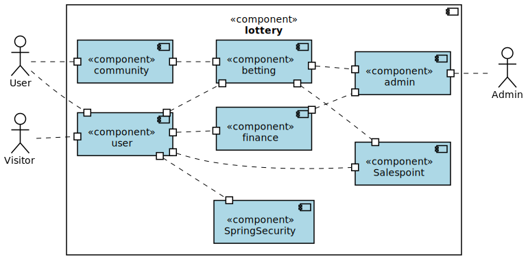
=== Entwurfsentscheidungen
==== Verwendete Muster

- Spring MVC
- Strategy
- Template Method

==== Persistenz

Die Anwendung verwendet Hibernate Annotation um die Java-Klassen in einer Datenbank zu hinterlegen. Als Datenbank wird H2 benutzt. Im Normalzustand ist die Funktion aktiviert. In der Datei _application.properties_ kann die automatische Speicherung deaktiviert werden.

==== Benutzeroberfläche
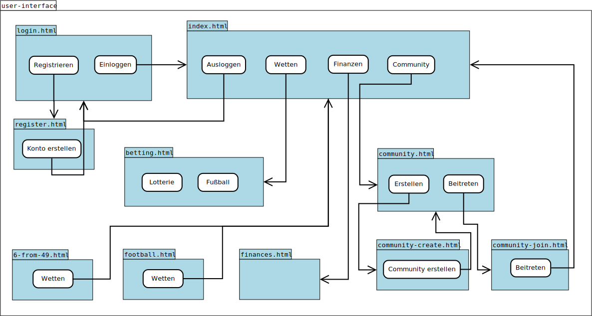

=== Verwendung externer Frameworks

[options="header", cols="1,2"]
|===
|Externes Package |Verwendet von (Klasse der eigenen Anwendung)
|salespointframework.catalog |betting.data.DataCatalog
|salespointframework.core a|
- user.UserDataInitializer
- betting.CatalogDataInitializer
- community.CommunityDataInitializer
|salespointframework.SalespointSecurityConfiguration |lottery.WebSecurityConfiguration
|salespointframework.Product |betting.data.Data
|salespointframework.userAccount |user.User
|springframework.boot |lottery.Lottery
|springframework.data a|
- betting.BetRepository
- community.CommunityRepository
- finance.FinanceRepository
- message.MessageRepository
- user.UserRepository
|springframework.security |lottery.WebSecurityConfiguration
|springframework.ui a|
- admin.AdminController
- betting.BetController
- community.CommunityController
- finance.FinanceController
- home.HomeController
- user.UserController
|springframework.validation a|
- user.UserController
|springframework.web a|
- lottery.LotteryWebConfiguration
- betting.data.football.rest.RestAPIParser
|===

== Bausteinsicht
=== Lottery
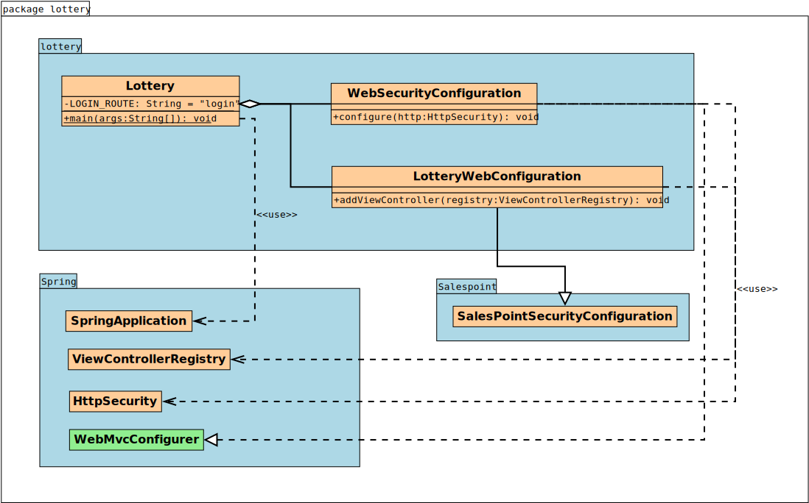

[options="header", cols="1,2"]
|===
|Klasse/Enumeration |Description
|Lottery|zentrale Anwendungsklasse um die Anwendung zu starten
|LotteryWebConfiguration |Konfigurationsklasse um _/login_ zu login.html zu binden
|WebSecurityConfiguration |Konfigurationsklasse um grundlegende Sicherheit einzustellen
|===

=== Home
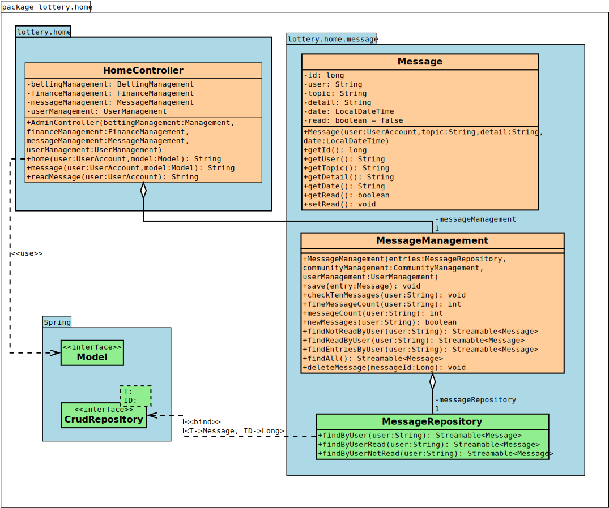

[options="header", cols="1,2"]
|===
|Klasse/Enumeration |Description
|HomeController|SpringMVC Controller welcher die Übersicht und Nachrichten zeigt
|Message|Eine Nachricht, die gespeichert werden soll
|MessageManagement|Eine Klasse, um die Logik der Nachrichten zu verwalten
|MessageRepository|Ein Interface um Nachrichten zu speichern
|===

=== User
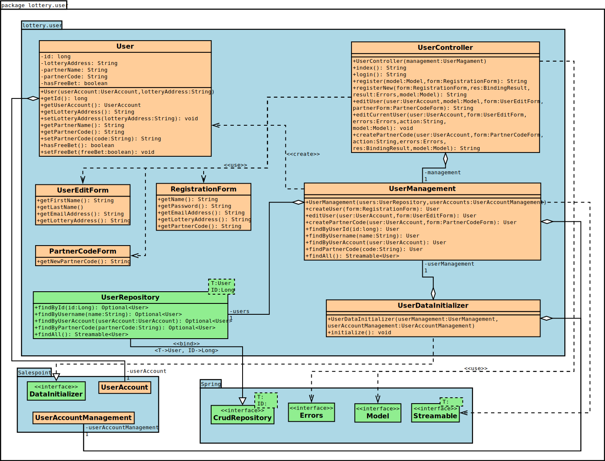

[options="header"]
|===
|Klasse/Enumeration |Description
|User| Eine Klasse, welche den Salespoint-UserAccount um eine E-Mail-Adresse erweitert.
|UserController | SpringMVC Controller, welcher Anfragen für die Registrierung und Anzeige von Nutzern verwaltet.
|UserDataInitializer | Eine Implementierung des DataInitializer um Standard-Nutzerkonten zu generieren.
|UserManagement | Eine Klasse, welche für die Nutzerverwaltung zuständig ist.
|UserRepository | Ein Interface für die Speicherung von Nutzerkonten, welches Instanzen von Nutzern verwaltet.
|RegistrationForm | Eine Klasse, welche die Eingaben des Nutzers bei einer Registrierung auf ihre Richtigkeit prüft.
|UserEditForm | Eine Klasse, welche die Eingaben des Nutzers bei einer ´Nutzerdatenänderung auf ihre Richtigkeit prüft.
|PartnerCodeForm | Eine Klasse, welche die Eingaben des Nutzers beim Erstellen eines Partnercodes auf Richtigkeit prüft.
|===

=== Community
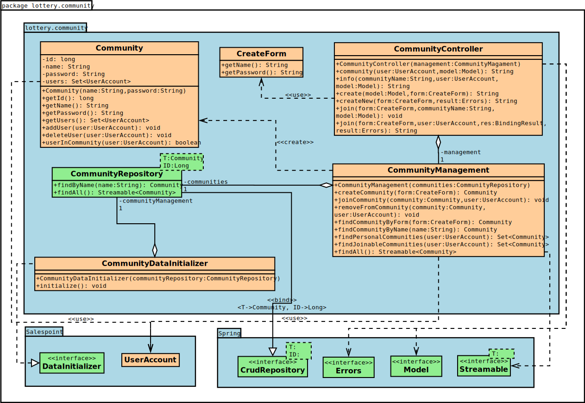

[options="header"]
|===
|Klasse/Enumeration |Description
|Community| Eine Klasse, welche den Salespoint-UserAccount um eine Liste der Mitglieder (userID) erweitert.
|CommunityController| SpringMVC Controller, welcher Anfragen für die Erstellung, Anzeige und Beitreten/Verlassen von Gemeinschaften verwaltet.
|CommunityDataInitializer| Eine Implementierung des DataInitializer um Standard-Gemeinschaften zu generieren.
|CommunityManagement| Eine Klasse, welche für die Verwaltung der Gemeinschaften zuständig ist.
|CommunityRepository| Ein Interface für die Speicherung von Gemeinschaften, welches Instanzen von Gemeinschaften verwaltet.
|CreateForm| Ein Interface, welches die Eingaben des Nutzers bei einer Erstellung einer Gemeinschaft auf ihre Richtigkeit prüft.
|===

=== Betting
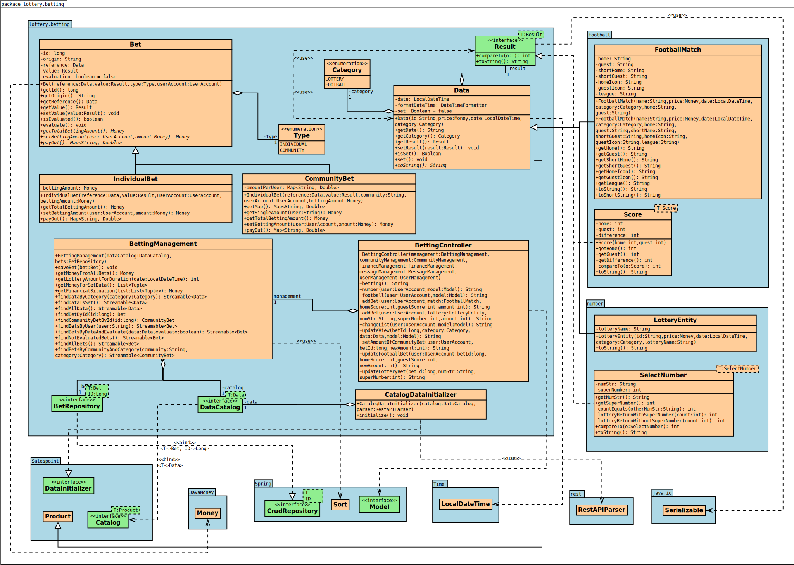

[options="header", cols="1,2"]
|===
|Klasse/Enumeration |Description
|BettingController |SpringMVC Controller, welcher mögliche Wetten anzeigt
|CatalogDataInitializer |Eine Implementierung des DataInitializer, um Standard-Daten zu generieren
|BettingCatalog |Eine Erweiterung von Catalog, um bestimmte Datensätze zu erhalten
|Bet |Oberklasse für alle platzierten Wetten
|Type |Enumeration, um Wetten schnell zu gruppieren
|IndividualBet |Eine Klasse für alle platzierten Einzelwetten
|CommunityBet |Eine Klasse für alle platzierten Gemeinschaftswetten
|Data |Oberklasse für alle Daten, auf die Wetten abgeschlossen werden können
|Category |Enumeration, um Daten einfach zu unterscheiden
|Result |Interface für alle Ergebnisarten
|Lottery |Eine Lotterieziehung, auf das eine Wette abgeschlossen wird
|FootballMatch |Ein Fußballspiel, auf das eine Wette abgeschlossen wird
|Draw |Ein Lotterieziehungsergebnis
|Score |Ein Fußballergebnis
|RestAPIParser |Ein Klasse, um die Daten von OpenLigaDB zu verarbeiten und in der Klasse FootballMatch zu speichern
|===

=== Finance
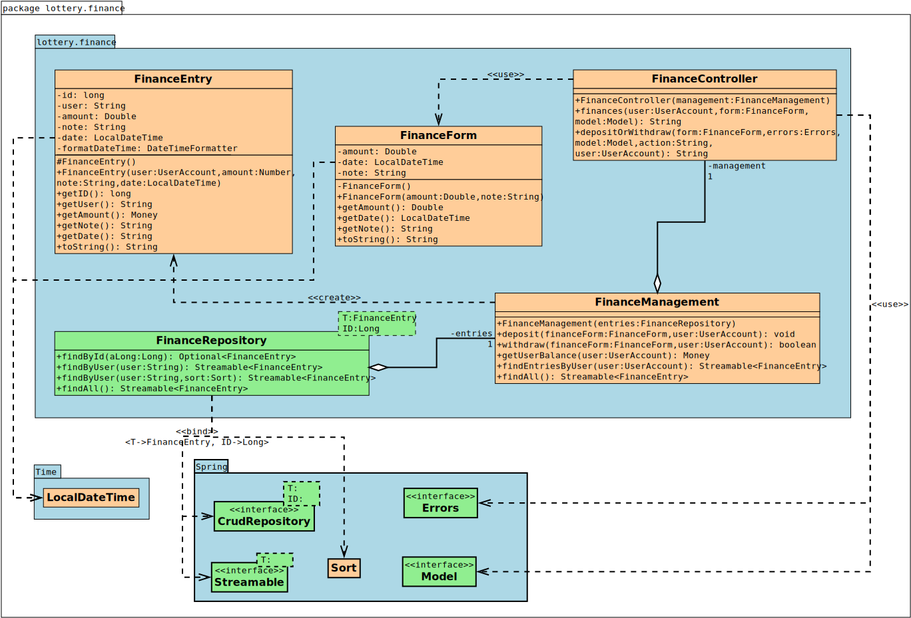

[options="header", cols="1,2"]
|===
|Klasse/Enumeration |Description
|FinanceController|SpringMVC Controller welcher Finanztransaktionen anzeigt
|FinanceEntry|Ein Finanzeintrag, der gespeichert werden soll
|FinanceForm|Eine Klasse um die Eingaben einer Finanztransaktion zu verarbeiten
|FinanceRepository|Ein Finanzrepository um Finanzeinträge zu speichern
|===

=== Admin
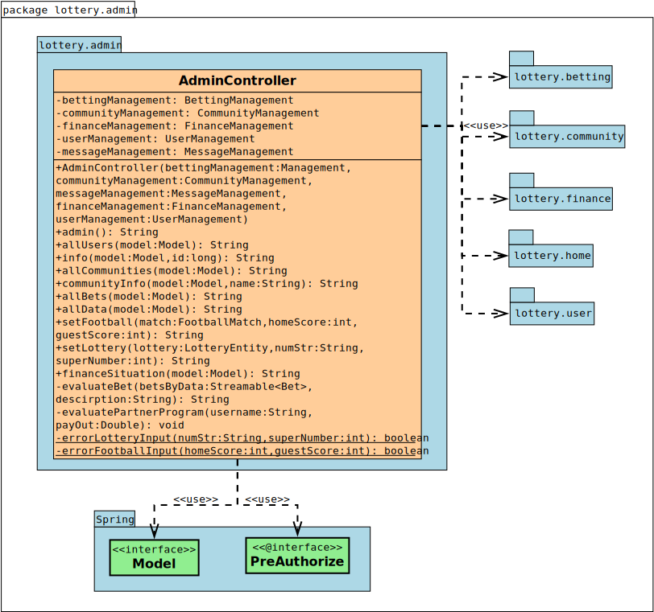

[options="header", cols="1,2"]
|===
|Klasse/Enumeration |Description
|AdminController|SpringMVC Controller welcher jegliche Admineinsichten zu realisieren
|===

=== Rückverfolgbarkeit zwischen Analyse- und Entwurfsmodell

[options="header", cols="1,2,2"]
|===
|Klasse/Enumeration (Analysemodell) |Klasse/Enumeration (Entwurfsmodell) |Art der Verwendung
|User a|
- Salespoint.UserAccount
- user.User a|
- Klassenattribut
- Methodenparameter
|Community a|
- community.Community a|
- Klassenattribut
- Methodenparameter
|CommunityManagement a|
- CommunityController
- CommunityManagement |
|Message|message.Message |
|Bet a|
- betting.Bet
- betting.IndividualBet
- betting.CommunityBet|
|Lottery |betting.BettingManagement |
|FootballPools |betting.BettingManagement |
|LotteryBet a|
- number.LotteryEntity
- Salespoint.Product |Vererbung/Implementierung
|FootballPoolsBet a|
- football.Match
- Salespoint.Product |Vererbung/Implementierung
|BetCatalog a|
- betting.DataCatalog
- Salespoint.Catalog
- betting.CatalogDataInitializer a|
- Vererbung/Implementierung
- Klassenattribut
|System a|
- admin.AdminController
- betting.BetController
- community.CommunityController
- finance.FinanceController
- home.HomeController
- user.UserController
- message.MessageManagement
- betting.BetRepository
- betting.DataCatalog
- community.CommunityRepository
- finance.FinanceRepository
- user.UserRepository|
|Finances a|
- finance.FinanceController
- finance.FinanceEntry
- finance.FinanceRepository
|
|BetManagement|admin.AdminController|
|===

== Laufzeitsicht
=== User
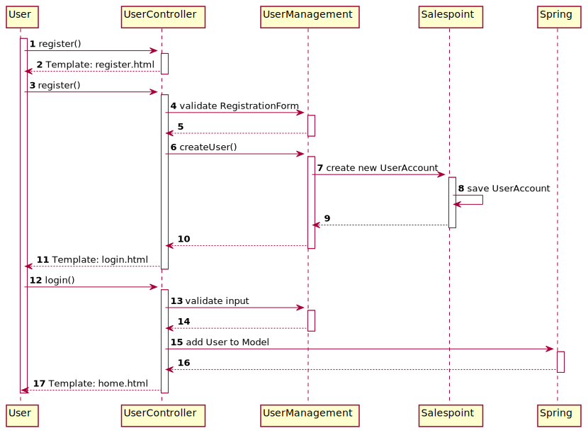

=== Community
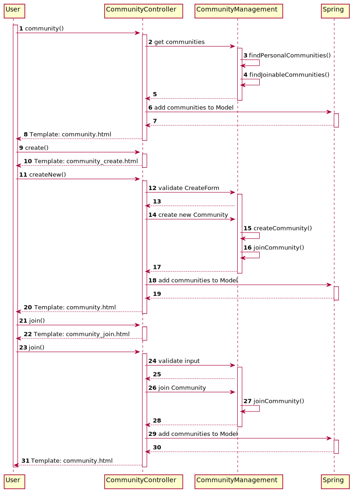

=== Betting
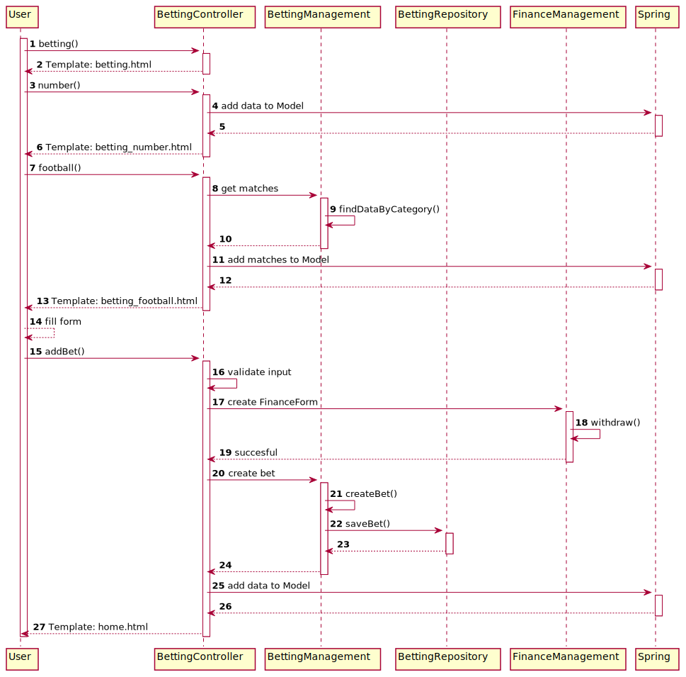

== Technische Schulden
=== Quality Gate
[options="header"]
|===
|Quality Gate |aktueller Wert |Ziel
|Reliability |A |A
|Security |A |A
|Maintainability  |A |A
|Coverage |52.75% |40%
|===

=== Probleme
[options="header", cols="1,4,3,2"]
|===
|Priorität |Beschreibung |Stelle |entsprechendes Quality Gate
|Major |Reduce the number of returns of this method 4, down to the maximum allowed 3.|betting.BettingController |Maintainability
|Major |Reduce the number of returns of this method 6, down to the maximum allowed 3.|user.UserController |Maintainability
|Major |Reduce the number of returns of this method 4, down to the maximum allowed 3.|user.UserController |Maintainability
|===

