= Pflichtenheft
:toc:
:toc-title: Inhaltsverzeichnis
:project_name: "MACH DEIN GLÜCK" - Onlinelotterie

== __{project_name}__

[options="header"]
[cols="1, 1, 1, 1, 4"]
|===
|Version | Status      | Bearbeitungsdatum   | Autoren(en) |  Vermerk
|0.1     | abgeschlossen   | 23.10.2021          | Nick       | Interessengruppen
|0.2     | abgeschlossen   | 24.10.2021          | Jing, Meng, Nick, Shiyue, Ziyi | Kontextdiagramm, Top-Level-Architektur, Anwendungsfälle
|1.1    | abgeschlossen   | 25.10.2021          | Hannes       | Aufgabe & Zielstellung, Funktionale & Nicht-funktionale Kriterien
|1.2     | abgeschlossen   | 27.10.2021          | Nick       | Verfeinerungen und Korrekturen
|1.3     | abgeschlossen   | 27.10.2021          | Jing, Meng, Shiyue, Ziyi       | Akzeptanzfälle
|1.4     | abgeschlossen   | 30.10.2021          | Hannes       | Verbesserungen
|2.0     | abgeschlossen   | 30.10.2021          | Nick       | GUI
|2.1     | abgeschlossen   | 30.10.2021          | Meng       | Enumeration des Klassendiagramm
|2.2     | abgeschlossen   | 31.10.2021          | Hannes       | Klassendiagramm
|3.0     | abgeschlossen   | 31.10.2021          | Hannes, Nick       | Glossar, letzte Optimierung
|3.0     | abgeschlossen   | 01.12.2021          | Nick       | Korrektur: Wohnadresse -> E-Mail-Adresse

|===

== Zusammenfassung

Dieses Dokument fungiert als Pflichtenheft des Projektes „MDG 2000“, ein Prototyp der virtuellen Lotterie „Mach Dein Glück!!“.
Es bietet einen Überblick über das zu entwickelnde Produkt und dient es als Fundament für die Kommunikation zwischen den Beteiligten des Projektes, insbesondere dem Auftraggeber und dem Entwicklungsteam. Des Weiteren stellt es die Grundlage für einen Vertrag zwischen Auftraggeber und Auftragnehmer dar und soll daher auf Konsistenz geprüft werden. Das Pflichtenheft beschreibt, was das gewünschte System erfüllen muss und wie der Auftragnehmer beabsichtigt, diese Lösung umzusetzen.

== Aufgabenstellung und Zielsetzung

Dieser Abschnitt gibt einen Überblick darüber, was das Produkt nach der Fertigstellung leisten soll.

In unserem kleinen Nachbarland Gamblien ist die staatlich betriebene Lotterie Mach Dein Glück!! sehr populär.
In Staatsbesitz befindet sich auch das weitverbreitete Netz an Annahmestellen.
Gambliens Wirtschaftsminister Lottermann plant den Einstieg in die "virtuelle Lotterie", um auch Ausländer als Kunden zu gewinnen.
Vorbereitend sollen der aktuelle Betrieb der Lotterie und der Annahmestellen auf Computer umgestellt und auf dieser Basis neue Dienste erprobt werden.
Aktuell gibt es bei Mach Dein Glück!! eine Zahlenlotterie mit wöchentlicher Ziehung und ein Fußballtoto.
Die Lotterie Mach Dein Glück!! ist eine ganz konventionelle Lotterie "6 aus 49 mit Zusatzzahl".
Tippscheine werden an den Annahmestellen bis zum Samstag eingereicht; am Sonntag erfolgt unter strenger notarieller Aufsicht die Ziehung.
Das Fußballtoto bezieht sich mangels eigener Liga auf die oberen beiden Klassen der deutschen Bundesliga.
Tippscheine können bis 24 Stunden vor Beginn des Spieltags (evtl. auf mehrere Spieltage verteilt und erst mit dem letzten Nachholspiel beendet) in Bundesliga bzw. Pokalrunden eingereicht werden.
Bei der Zahlenlotterie können derzeit neben Einzeltippscheinen auch Dauertippscheine (monatlich, halb- bzw. ganzjährig) erworben werden.
Tippscheine für das Fußballtoto können ab Veröffentlichung der Spielkalender beliebig im Voraus ausgefüllt und abgegeben werden.
Nach Minister Lottermanns Plänen soll das Angebot künftig gemäß den neuen Medien flexibler gestaltet sein:

* Sobald ein unregistrierter Besucher die virtuelle Lotterie aufruft, erhält dieser die Möglichkeit sich zu registrieren.
* Jeder registrierte Kunde erhält ein Konto, welches ihm ermöglicht, per Überweisung, Tippscheine zu erwerben und Einblick in mögliche Gewinne oder Verluste bietet.
Des Weiteren werden auf dem Konto alle Mitteilungen angezeigt, welche vom System an den Kunden verschickt werden.
* Es werden Gewinngemeinschaften unterstützt. Beim Einrichten einer Gewinngemeinschaft wird von der Lotterie ein Gemeinschafts-Passwort vergeben.
Wer das Gemeinschafts-Passwort kennt, darf für die Gemeinschaft einen Tipp abgeben und darf seinerseits an Personen Mitglieder-Passwörter vergeben.
Mit dem Mitglieder-Passwort kann die Person ihre Anteile (ganzzahlige Vielfache des Grundeinsatzes) bis jeweils vor Wettschluss (gegen Bar- bzw. Vorauszahlung) erhöhen oder verringern bzw. zeitweilig ganz aussetzen.
* Änderungen am Tipp bzw. Einsatz sind bis jeweils 5 Minuten vor Beginn einer Auslosung bzw. eines Fußballspieltags möglich.
Anschließend sperrt das System jegliche Versuche, einen Tippschein abzugeben.
* An die Stelle von Bareinzahlung sollen künftig Abbuchungen von Konten bei der Lotteriebank treten, die jeder Kunde dort einrichtet und auf die er bar oder per Überweisung rechtzeitig seine Einsätze überträgt.
Von diesem Konto werden (in der Reihenfolge der Auslosungen) Einsätze abgebucht.
Bei nicht ausreichender Deckung erhält der Kunde eine entsprechende Mitteilung und nimmt an dieser Verlosung nicht teil.
Je Mitteilung wird eine Gebühr von 2 € erhoben; nach zehn Mitteilungen wird der Kunde vorläufig aus seinen Gewinngemeinschaften entfernt.
Hat der Kunde eine Ziehung oder ein Fußballtoto gewonnen, kann er sich das gewonnene Geld auf sein Lotterie-Konto auszahlen lassen.
* Die für das Fußballtoto benötigten Daten werden vom System direkt und aktuell aus dem Internet bezogen.
* Administratoren der Lotterie sollen die Möglichkeit haben, jederzeit eine Übersicht über die abgegebenen Wetten der Kunden und die finanzielle Situation (Gewinne/Verluste) der Lotterie nach dem jeweiligen Ziehungstagen und Spieltagen zu bekommen.
* Minister Lottermann hat unter dem Aktenzeichen "MDG 2000" eine Ausschreibung veröffentlicht, und um Einreichung geeigneter, künftig ausbaubarer Prototypen für ein solches System gebeten.

Das Ziel des hier beschriebenen Projektes ist die Erstellung einer einfach zu bedienenden und für jedermann zugänglichen virtuellen Lotterie, welche die oben beschriebenen Aufgaben verlässlich und möglichst effizient erfüllen kann.
Der Prototyp soll des Weiteren künftig ausbaubar und gut wartbar sein.

== Produktnutzung
Die Anwendung soll als Online-Variante der Lotterie "Mach Dein
Glück!!" verwendet werden und wird vom Wirtschaftsministerium Gambliens betrieben. Die Plattform sollte auf einem Server betrieben werden, welcher das Glücksspiel zu jeder Zeit ermöglicht.

Das System soll für folgende Browser optimiert werden:

- Mozilla Firefox
- Google Chrome
- Apple Safari

Der Hauptnutzer der Anwendung sollen jegliche Menschen aus dem In- und Ausland sein. Dabei soll das Erlebnis für angemeldete User priorisiert werden. Die Nutzung soll durch eine eindeutige Benutzeroberfläche für jeden zugänglich sein. Wetten sind schnell abschließbar, um den Nutzer intuitive Entscheidungen zu vereinfachen. Der Administrator hat Einsicht über alle Aktivitäten auf der Plattform, ohne groß Einfluss nehmen zu müssen.

== Interessensgruppen (Stakeholders)
[options="header", cols="2, ^1, 3, 4"]
|===
|Name
|Priorität (1..5)
|Beschreibung
|Ziele

|Wirtschaftsministerium Gamblien
|4
|Auftraggeber des Projektes.
a|
- Popularität der Lotterie ins Ausland verbreiten
- Glücksspiel online etablieren
- wirtschaftlichen erfolg erzielen
- automatisiertes Auswerten von Tippscheinen

|Nutzer
|5
|primärer Nutzer vom Online-Service
a|
- übersichtliche Darstellung der Funktionen
- schnelles Wetten
- zuverlässige Gewinnauszahlung

|Besucher
|1
|kein Nutzer der Webseite
a|
- wenig Input über Service preisgeben

-> Besucher zum Registrieren verleiten, um mehr zu erfahren

|Admin
|2
|Administrator der Webseite
a|
- Möglichkeit, alle Wetten einzusehen
- Überwachung der Finanzen der Lotterie

|Programmierer
|3
|Menschen, die später auf dem Grundgerüst des Services aufbauen können für weitere Erweiterungen.
a|
- leicht erweiterbare Webseite
- testbasierte Anwendung für bessere Kontrollen
|===

== Systemgrenze und Top-Level-Architektur

=== Kontextdiagramm

=== Top-Level-Architektur
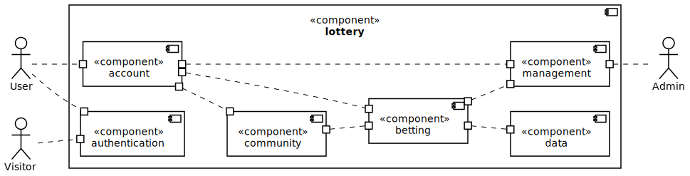

== Anwendungsfälle

=== Akteure

[options="header"]
[cols="1,4"]
|===
|Name |Beschreibung
|Visitor  |repräsentiert jeden Menschen, der die Webseite ohne angemeldeten Nutzeraccount besucht
|User |repräsentiert jeden Menschen, der einen eingeloggten Account besitzt und die Webseite zum Wetten verwenden möchte
|Admin |repräsentiert jeden User, der Admin-Rechte besitzt; kann auf jegliche Wetten zugreifen und die Finanzsituation überwachen
|===

=== Überblick Anwendungsfalldiagramm

[[use_case_diagram]]
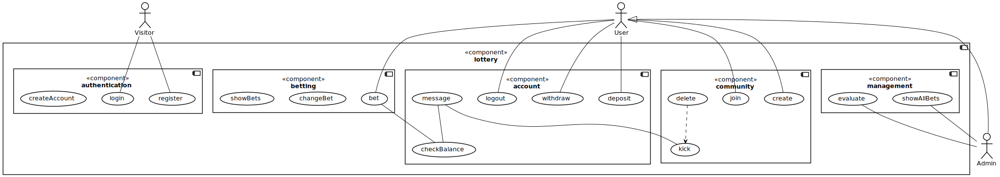

=== Anwendungsfallbeschreibungen
[cols="1h, 3"]
[[UC0010]]
|===
|ID                         |**<<UC0010>>**
|Name                       |register
|Beschreibung               |Visitor können einen Account erstellen
|Akteur                     |Visitor
|Trigger                    |Visitor klickt auf "Registrieren"
|Voraussetzungen           a|Visitor ist nicht angemeldet
|Essenzielle Schritte      a|
1. Visitor klickt auf den "Registrieren"
2. Visitor wird auf "register.html" weitergeleitet
3. Visitor gibt Daten ein und klickt auf "Registrieren"
4. System erstellt ein neues Konto
|Erweiterungen              |-
|Funktionale Voraussetzungen|[F0001][F0002]
|===

[cols="1h, 3"]
[[UC0020]]
|===
|ID                         |**<<UC0020>>**
|Name                       |login/logout
|Beschreibung               |Visitor soll mit eigenem Konto einloggen können, dieser Vorgang kann durch Abmelden rückgängig gemacht werden.
|Akteur                     |
Login: Visitor

Logout: User
|Trigger                    |
_Login_:
Visitor klickt auf den Knopf “einloggen”.
_Logout_:
Visitor klickt auf den Knopf “ausloggen”.

|Voraussetzungen           a|
_Login_:
Akteur ist nicht angemeldet.

_Logout_:
Akteur ist angemeldet.
|Essenzielle Schritte      a|
_Login_:

1. Visitor klickt auf den "einloggen".
2. Visitor wird auf "login.html" weitergeleitet.
3. Visitor gibt Daten ein und klickt auf "einloggen".
4. System prüft die Korrektheit der eingegebenen Daten.
1.Richtige Daten: Visitor wird User und erhält Zugang zur Hauptseite.
2.Fehler: Anzeige der Fehlermitteilung.

_Logout_:

1. User klickt auf den "ausloggen".
2. Nutzer kehrt zurück zur Loginseite und wird Visitor.

|Erweiterungen              |-
|Funktionale Voraussetzungen|[F0003]
|===

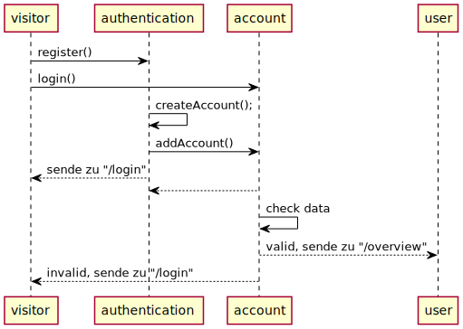

[cols="1h, 3"]
[[UC0030]]
|===
|ID                         |**<<UC0030>>**
|Name                       |showBets
|Beschreibung               |
Jeder Besucher (d.h. User und Visitor) sollte auf den Katalog zugreifen können,
in dem alle angebotenen Lotterien aufgeführt sind.
Der Katalog muss eine Unterscheidung zwischen den verschiedenen Arten von Lotterien (Zahlenlotterien und Fußballlotterien) enthalten
|Akteur                     |User/Visitor
|Auslöser                   |Akteur klickt auf den Knopf "Zahlenlotterien" oder "Fußballlotterien".
|Voraussetzungen           a|
|Essenzielle Schritte      a|
1. Der Akteur klickt auf den Knopf "Zahlenlotterien" oder "Fußballlotterien".
2. Alle gewählten Lotteriensart werden angezeigt.
|Erweiterungen              |-
|Funktionale Voraussetzungen|[F0006]
|===

[cols="1h, 3"]
[[UC0040]]
|===
|ID                           |**<<UC0040>>**
|Name                         |bet/bet change
|Beschreibung                 |User können Wetten platzieren und die Anzahl der Wetten ändern.
|Akteur                       |User
|Auslöser                     |User klickt auf den Knopf “bet”.
|Voraussetzungen             a|ist als User eingeloggt
|Essenzielle Schritte        a|
1. User klickt auf den Knopf “bet/bet change”.
2. User gibt die Anzahl der Wetten ein.
|Erweiterungen                |-
|Funktionale Voraussetzungen  |[F0006][F0007][F0008][F0009][F0010]
|===

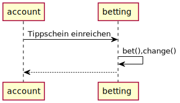

[cols="1h, 3"]
[[UC0050]]
|===
|ID                         |**<<UC0050>>**
|Name                       |checkBalance
|Beschreibung               |Jeder User kann seinen Kontostand einsehen.
|Akteur                     |User
|Auslöser                    |Akteur klickt auf den Knopf "Kontostand" .
|Voraussetzungen           a|Akteur ist eingeloggt.
|Essenzielle Schritte            a|
1. Der Akteur klickt auf den Knopf "Kontostand".
2. Der Kontostand wird angezeigt.
|Erweiterungen              |-
|Funktionale Voraussetzungen|[F0012]
|===

[cols="1h, 3"]
[[UC0060]]
|===
|ID                         |**<<UC0060>>**
|Name                       |withdraw/deposit
|Beschreibung               |User können ihr Guthaben abheben oder ihr Konto aufladen.
|Akteur                     |User
|Auslöser                   |
_withdraw_: Akteur klickt auf den Knopf "withdraw".

_deposit_: Akteur klickt auf den Knopf "deposit".
|Voraussetzungen           a|Akteur ist eingeloggt.
|Essenzielle Schritte      a|
1. Akteur wählt den Betrag, den er aufladen oder abheben möchte.
2. Akteur klickt auf den Knopf "withdraw" oder "deposit".
|Erweiterungen              |-
|Funktionale Voraussetzungen|[F0013][F0014]
|===

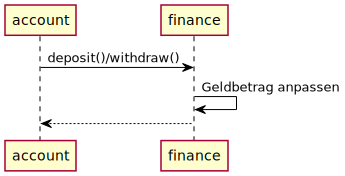

[cols="1h, 3"]
[[UC0080]]
|===
|ID                         |**<<UC0080>>**
|Name                       |create
|Beschreibung               |User kann eine Gemeinschaft erstellen, das Passwort der Gemeinschaft erhalten und das Passwort verwenden, um andere in die Gemeinschaft einzuladen.
|Akteur                     |User
|Auslöser                   |User möchte eine Gemeinschaft erstellen.
|Voraussetzungen           a|User hat sich beim System authentifiziert.
|Essenzielle Schritte      a|User klickt auf der Webseite auf den Knopf "Eine Gemeinschaft erstellen".
|Erweiterungen              |User kann andere Mitglieder in der Gemeinschaft einladen.
|Funktionale Voraussetzungen|[F0015]
|===

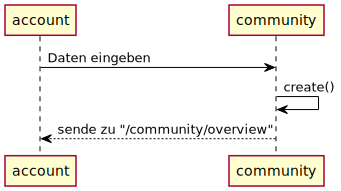

[cols="1h, 3"]
[[UC0090]]
|===
|ID                         |**<<UC0090>>**
|Name                       |join
|Beschreibung               |User kann in einer Gemeinschaft beitreten.
|Akteur                     |User
|Auslöser                  a|User möchte in einer Gemeinschaft beitreten.
|Voraussetzungen           a|
1. User hat sich beim System authentifiziert.
2. User hat ein Passwort einer Gemeinschaft.
|Essenzielle Schritte      a|
1.User drückt auf der Website auf den Knopf "Gemeinschaft beitreten".
2.User gibt das Passwort ein.
|Erweiterungen              |-
|Functional Requirements    |[F0016]
|===

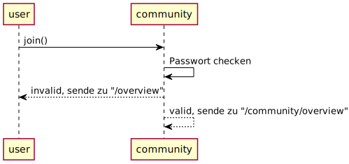

[cols="1h, 3"]
[[UC0100]]
|===
|ID                         |**<<UC0100>>**
|Name                       |delete
|Beschreibung               |User kann aus einer Gemeinschaft austreten.
|Akteur                     |User
|Auslöser                   |User möchte aus einer Gemeinschaft austreten.
|Voraussetzungen           a|
1. User hat sich beim System authentifiziert.
2. User ist ein Mitglied der Gemeinschaft.
|Essenzielle Schritte      a|User drückt auf der Website die Schaltfläche "Gemeinschaft löschen".
|Erweiterungen              |-
|Funktionale Voraussetzungen|-
|===

[cols="1h, 3"]
[[UC0110]]
|===
|ID                         |**<<UC0110>>**
|Name                       |kick
|Beschreibung               |Nach zehn erfolglosen Abbuchungsbenachrichtigungen wird der Nutzer vorübergehend aus der Community entfernt.
|Akteur                     |Gemeinschaft
|Auslöser                   |Ein Nutzer in einer Gemeinschaft hat eine erfolglose Abbuchungsbenachrichtigungen erhalten.
|Essenzielle Schritte      a|
1. Akteur ist in der Gemeinschaft.
2. Akteur hat schon neun mal erfolglose Abbuchungsbenachrichtigungen erhalten.
|Essenzielle Schritte      a|--
|Erweiterungen              |--
|Funktionale Voraussetzungen|[F0018]
|===

[cols="1h, 3"]
[[UC0130]]
|===
|ID                         |**<<UC0130>>**
|Name                       |showAllBets
|Beschreibung               |Der Administrator überprüft den Wettstatus jedes Benutzers
|Akteur                     |Admin
|Auslöser                   |Klicken Administratoren auf "Wettstatus"
|Voraussetzungen           a|Nutzer hat Lotto gekauft
|Essenzielle Schritte      a|
1. Der Administrator klickt auf ""Lottoergebnisse anzeigen".
2. Besuchen Sie jedes Benutzerkonto, um den Wettstatus zu erfahren.
3. Die Seite zeigt den Wettstatus aller teilnehmenden Benutzer in der Community.
|Erweiterungen              |-
|Funktionale Voraussetzungen|[F0022]
|===

[cols="1h, 3"]
[[UC0150]]
|===
|ID                         |**<<UC0150>>**
|Name                       |Evaluation eines Tippscheins
|Beschreibung               |System bestimmt, ob das Guthaben auf dem Konto des Benutzers ausreicht, um die Lotterie zu bezahlen
|Akteur                     |-
|Auslöser                   |Klicken Administratoren auf "Ergebnisse zeichnen"
|Voraussetzungen           a|
1. Nutzer besitzt Lottotippschein
|Essenzielle Schritte      a|
1. Das System sendet einen Abzugsantrag an das Konto
2. Das Konto beurteilt, ob das Guthaben ausreicht, um die Lottokaufkosten zu bezahlen
3. Wenn nicht genug, Nachricht an User, Tippschein wird nicht eingetragen
4. Falls ausreichend, Geld vom Konto abbuchen und Tippschein hinzufügen
|Erweiterungen              |-
|Funktionale Voraussetzungen|
|===

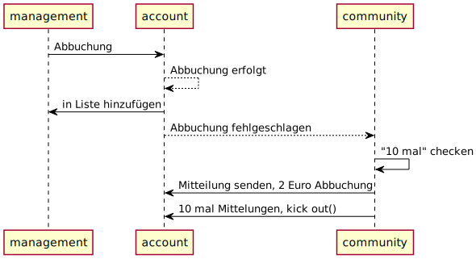

[cols="1h, 3"]
[[UC0170]]
|===
|ID                         |**<<UC0170>>**
|Name                       |Geld vergeben
|Beschreibung               |Das System sendet Geld an das Konto des Gewinners
|Akteur                     |Admin
|Auslöser                   |Klicken Administratoren auf "Ergebnis Abrechnung"
|Voraussetzungen           a|
1. Lotterieergebnisse bekannt gegeben
2. Der Nutzer ist der Gewinner
|Essenzielle Schritte      a|
1. Der Manager klickt auf "Auswerten"
2. Berechnen Sie den Betrag, den jeder Nutzer erhält
3. Geld auf das Benutzerkonto überweisen
|Erweiterungen              |-
|Funktionale Voraussetzungen|[F0023]
|===

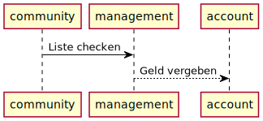

== Funktionale Anforderungen

=== Muss-Kriterien
Dieser Abschnitt bietet einen Überblick aller Anforderungen, welche das System leisten muss.

Die folgende Tabelle enthält:

- Eine eindeutige ID für die Anforderung
- Ein Name der Anforderung
- Eine Beschreibung der Anforderung

[cols="1,2,5"]
|===
|ID |Name |Beschreibung

|[F0001]
|Registrierung
a|Das System stellt nicht registrierten Nutzern die Möglichkeit zur Verfügung, einen Account zu erstellen.
Für eine Registrierung werden folgende Informationen benötigt:

- Nutzername (Einzigartig)
- Passwort
- E-Mail-Adresse
- Lotteriebank-Adresse

Das System prüft die angegeben Daten auf ihre Richtigkeit([F0002]). Nach erfolgreicher Überprüfung wird der Nutzer im System eingetragen([F0003]) und ist in der Lage sich Anzumelden.

|[F0002]
|Registrierung validieren
a|Das System ist in der Lage, die Informationen eines nicht registrierten Nutzers auf ihre Richtigkeit zu überprüfen.
Folgende Daten werden überprüft:

- Einzigartigkeit des Nutzernamens
- Stimmigkeit der E-Mail-Adresse
- Stimmigkeit der Lotteriebank-Adresse

Bei Unstimmigkeiten wird der Nutzer umgehend informiert und kann die Daten gegebenenfalls Anpassen.

|[F0003]
|Anmeldung
a|Das System ist aufgeteilt in Bereiche, die jedem Nutzer frei zur Verfügung stehen und Bereiche, welche nur durch Login benutzt werden können. Nutzer können durch folgende Informationen Identifiziert:

- Nutzername
- Passwort

|[F0004]
|Konto einsehen
a|Das System ermöglicht dem Nutzer in sein Konto einzusehen. Es können folgende Informationen eingesehen werden:

- Nutzername
- E-Mail-Adresse

|[F0005]
|Konto bearbeiten
a|Das System ermöglicht dem Nutzer, bei Bedarf, Informationen zu bearbeiten oder hinzuzufügen. Folgende Informationen können bearbeitet werden:

- Passwort
- E-Mail-Adresse
- Lotteriebank-Adresse

Das System überprüft bei Änderung die neuen Daten auf ihre Richtigkeit.
Folgende Daten werden überprüft:

- Passwort ist anders
- Stimmigkeit der E-Mail-Adresse
- Stimmigkeit der Lotteriebank-Adresse

Bei Unstimmigkeiten wird der Nutzer umgehend informiert und kann die Daten gegebenenfalls Anpassen.

|[F0033]
|Kontobearbeitung validieren
|Das System ist in der Lage die geänderten Informationen auf ihre Richtigkeit zu überprüfen.

|[F0006]
|Verfügbare Tippscheine einsehen
|Das System ermöglicht dem Nutzer die Einsicht in alle aktuellen Tippscheine, welche erworben werden können

|[F0007]
|Tippschein erwerben
|Das System ermöglicht dem Nutzer beliebig Tippscheine zu erwerben.
Nach Erwerb von Tippscheinen werden die Einsätze in Reihenfolge der Auslosungen vom Lotteriekonto des Nutzers abgebucht.

|[F0008]
|Tippschein ausfüllen
a|Das System ermöglicht dem Nutzer die erworbenen Tippscheine nach den Regeln der jeweiligen Verlosung auszufüllen.

|[F0009]
|Tippschein ändern
a|Das System bietet dem Nutzer die Möglichkeit eine Änderung am Tippschein vorzunehmen.

Folgende Informationen können verändert werden:

- Tipp
- Einsatz

|[F0010]
|Dauertippschein erwerben
|Das System ermöglicht dem Nutzer Dauertippscheine für die Zahlenlotterie zu erwerben.
Der Nutzer kann hier zwischen monatlicher, halbjähriger und ganzjähriger Dauer unterscheiden.
Nach Erwerb des Dauertippscheins kann der Nutzer seinen Tipp abgeben.

|[F0011]
|Erworbene Tippscheine einsehen
|Das System ermöglicht dem Nutzer seine momentan abgegebenen Tippscheine einzusehen.

|[F0012]
|Finanzen einsehen
|Das System ermöglicht dem Nutzer in die finanzielle Situation seines Lotterie-Kontos einzusehen.

|[F0013]
|Geld abbuchen
|Das System bucht bei Erwerb von Tippscheinen den Einsatz vom Lotteriekonto des Nutzers ab.
Bei unzureichender Deckung erhält der Nutzer eine Mitteilung und wird von dieser Auslosung ausgeschlossen.

|[F0014]
|Geld auszahlen
|Das System ermöglicht dem Nutzer gewonnenes Geld auf ihr Lotteriekonto auszuzahlen.

|[F0015]
|Gewinngemeinschaft gründen
|Das System ermöglicht dem Nutzer eine Gewinngemeinschaft zu gründen.
Bei der Gründung wird ein Mitglieder-Passwort festgelegt. Dieses Passwort kann weitergegeben werden. Kennt ein Nutzer dieses Passwort, kann er der Gemeinschaft beitreten.

|[F0016]
|Gewinngemeinschaft beitreten
|Das System ermöglicht dem Nutzer einer Gewinngemeinschaft beizutreten. Mitglieder der Gemeinschaft können dieses Passwort an weiter Nutzer weitergeben und für die Gemeinschaft einen Tipp abgeben.

|[F0017]
|Gewinngemeinschaft Tipp abgeben
|Das System ermöglicht dem Nutzer für die Gemeinschaft einen Tipp abzugeben. Neben dem Tipp kann der Nutzer auch seinen Anteil erhöhen, verringern oder zeitweilig aussetzen. Der Anteil muss ein ganzzahliges Vielfaches des Grundeinsatzes sein.

|[F0018]
|Gewinngemeinschaft Mitglied entfernen
|Sobald ein Mitglied einer Gewinngemeinschaft 10 Mitteilungen für unzureichende Deckung erhalten hat, wird dieses vorläufig aus der Gemeinschaft entfernt.

|[F0019]
|Mitteilungen einsehen
|Das System ermöglicht dem Nutzer die Einsicht in seine erhaltenen Mitteilungen.

|[F0020]
|Mitteilung bei unzureichender Deckung
a|Das System sendet bei unzureichender Deckung eine Mitteilung an das Nutzerkonto. Dabei wird eine Gebühr von 2 Euro vom Lotteriekonto des Nutzers abgebucht.
Die Mitteilung beinhaltet folgende Informationen:

- Mitteilung der Nichtteilnahme an der Verlosung
- Grund der Nichtteilnahme
- Hinweis auf eine Gebühr von 2 Euro für diese Mitteilung

Nach 10 Mitteilungen wird der Nutzer vorläufig aus all seinen Gemeinschaften entfernt.

|[F0021]
|Admin Einsicht finanzieller Status
|Das System ermöglicht einem Administrator einen Tag nach einer Ziehung oder eines Spiels die Einsicht in dessen Gewinne oder Verluste.

|[F0022]
|Admin Übersicht abgegebene Wetten
|Das System ermöglicht einem Administrator jederzeit die Einsicht in alle abgegebenen Wetten der Nutzer.
Dies beinhaltet den Nutzernamen und den abgegebenen Tipp.

|[F0023]
|Durchführung Ziehung
|Das System ermöglicht einem Administrator jeden Sonntag eine Ziehung der Zahlenlotterie durchzuführen

|[F0024]
|Auswertung Ziehung/Spiel
|Das System wertet nach jeder Ziehung/nach jedem Spiel die Ergebnisse aus und ermittelt die Gewinner.
Anschließend werden die Gewinne auf die Konten der Gewinner überwiesen.

|[F0025]
|Überweisung Gewinne
|Hat ein Nutzer eine Ziehung gewonnen, wird anschließend der Gewinnbetrag auf sein Konto übertragen

|===

=== Kann-Kriterien
Dieser Abschnitt bietet einen Überblick aller Anforderungen, welche das System leisten kann, aber nicht zwingend für den Betrieb des Systems benötigt werden.

Die folgende Tabelle enthält:

- Eine eindeutige ID für die Anforderung
- Der Name der Anforderung
- Die Beschreibung der Anforderung

[cols="1,2,5"]
|===
|ID |Name |Beschreibung

|[F0026]
|Mehrere Sprachen
|Das System unterstützt mehrere Sprachen. Die angezeigte Sprache kann beliebig umgestellt werden.

|[F0027]
|Fußballtoto-Daten aus Internet
|Das System bezieht alle Daten, welche für das Fußballtoto benötigt werden, direkt und aktuell aus dem Internet

|[F0028]
|Mitteilung Gewinn/Verlust
|Das System benachrichtigt den Nutzer nach einer abgeschlossenen Ziehung/Spiel, ob dieser Gewonnen oder Verloren haben.
Diese Nachricht ist nicht kostenpflichtig.

|[F0029]
|Gewinngemeinschaft Mitglieder einsehen
|Das System ermöglicht dem Nutzer, welcher in eine Gewinngemeinschaft eingetragen ist, dessen Mitglieder und deren Einsatz zu sehen.

|[F0030]
|Einhaltung Abgabezeit
a|Das System prüft bei jeder Abgabe eines Tippscheines, ob der jeweilige Zeitramen eingehalten wurde:

- Tippscheine für die Lotterie können bis Samstag eingereicht werden
- Tippscheine für das Fußballtoto können bis 24 Stunden vor dem Spieltag eingreicht werden.

Änderungen am Tipp können bis 5 Minuten vor Ziehung oder Spielbeginn vorgenommen werden.

|[F0032]
|Unterstützung E-Mail Adresse
|Bei Registrierung kann der Kunde eine E-Mail-Adresse angeben, auf die Mitteilungen gesendet werden können.
Die Unterstützung einer solchen Adresse ermöglicht dem System ebenfalls eine 2-Faktor-Authentifizierung, welche der Kontosicherheit betragen kann.
Die E-Mail-Adresse wird bei Registrierung und Änderung des Kontos validiert.

|===

== Nicht-Funktionale Anforderungen

=== Qualitätsziele

Dieser Abschnitt bietet einen Überblick aller Qualitätsziele, welche das System erreichen soll.

Die Folgende Tabelle enthält:

- Der Name des Qualitätsziels
- Die Priorität des Qualitätsziels (1= nicht wichtig, 5= sehr wichtig)
- Eine Beschreibung des Qualitätsziels

[cols="2,1,5"]
|===
|Qualitätsziel |Priorität |Beschreibung

|Sicherheit
|3
|Das System legt Wert auf die Sicherheit der Nutzerkonten, da hier primär transaktionen mit dem Geld der registrierten Nutzer getätigt werden.

|Nutzerfreundlichkeit
|5
|Das System bietet eine benutzerfreundliche Oberfläche, die ein breites Spektrum von Personen- und Altersgruppen abdeckt.

|Erreichbarkeit
|4
|Das System ist zu jeder Zeit von einem Rechner aus erreichbar.

|Wartbarkeit
|3
|Das System ist schnell und einfach zu warten. Das dient dazu, die Systemsicherheit und die Funktionsfähigkeit zu erhalten.

|Ausbaubarkeit
|4
|Das System ermöglicht, falls gewünscht, neue Funktionen und Inhalte schnell und einfach hinzuzufügen.
|===

=== Konkrete Nicht-Funktionale Anforderungen

Dieser Abschnitt bietet einen Überblick aller Nicht-Funktionalen Anforderungen, welche dazu dienen, die Qualitätsziele zu erreichen.

Die Folgende Tabelle enthält:

- Eine Eindeutige ID der Anforderung
- Der Name der Anforderung
- Die Beschreibung der Anforderung

[cols="1,2,5"]
|===
|ID |Name |Beschreibung

|[NF0001]
|Sicherheit -  Passwortspeicherung
|Die Passwörter der Nutzer werden verschlüsselt gespeichert.

|[NF0002]
|Nutzerfreundlichkeit - Barrierefreiheit
|Um möglichst viele Personengruppen anzusprechen, hat der Text einen hohen Kontrast, um auch bei einer Sehschwäche gut erkannt zu werden.

|[NF0003]
|Erreichbarkeit - Uptime
|Das System soll eine Uptime von mindestens 99% erreichen.
|===

== GUI Prototyp

=== /login
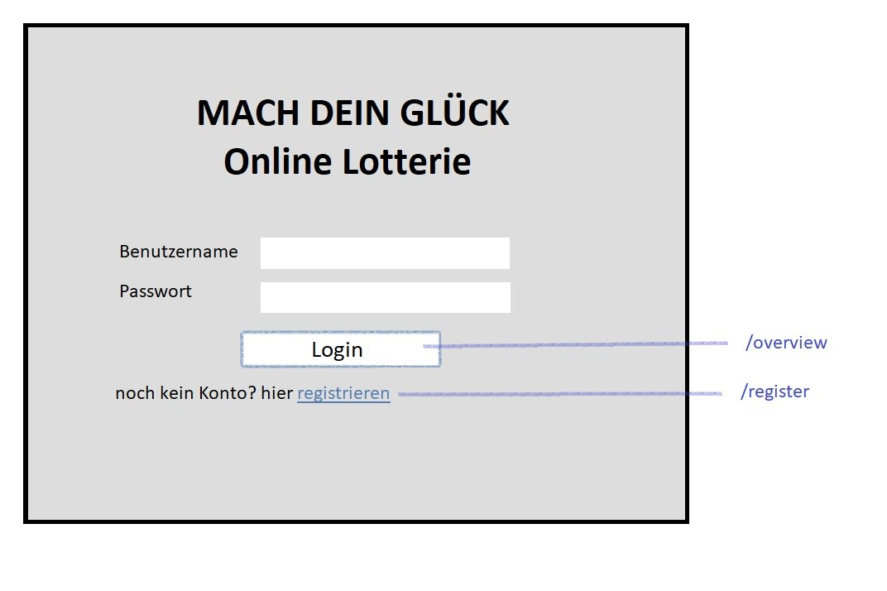

- Startseite, bringt Besucher direkt zum Einloggen
- Registrierungsmöglichkeit

=== /register
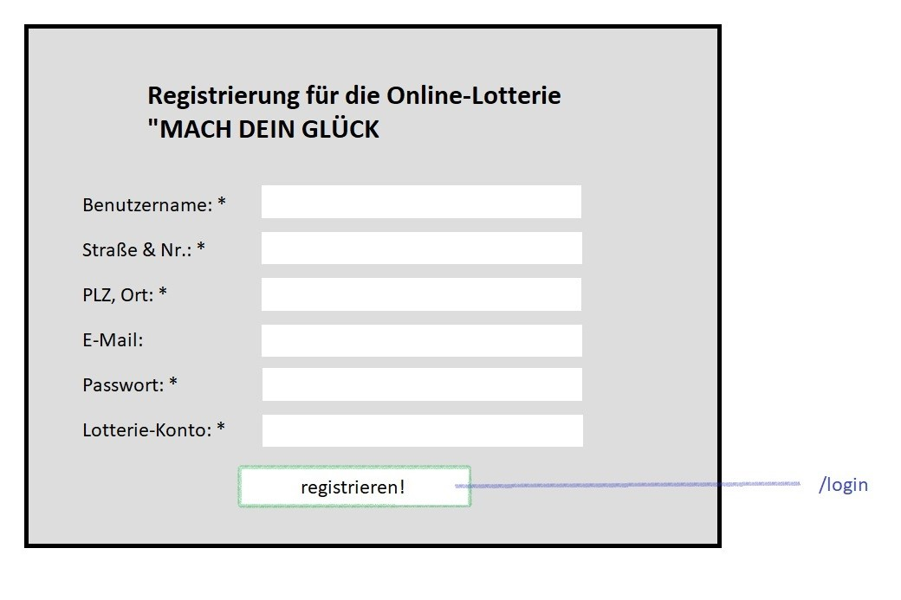

- Formular für Userdaten
- durch Registrieren-Button werden Daten überprüft und ggf. Nutzer erstellt

=== /overview
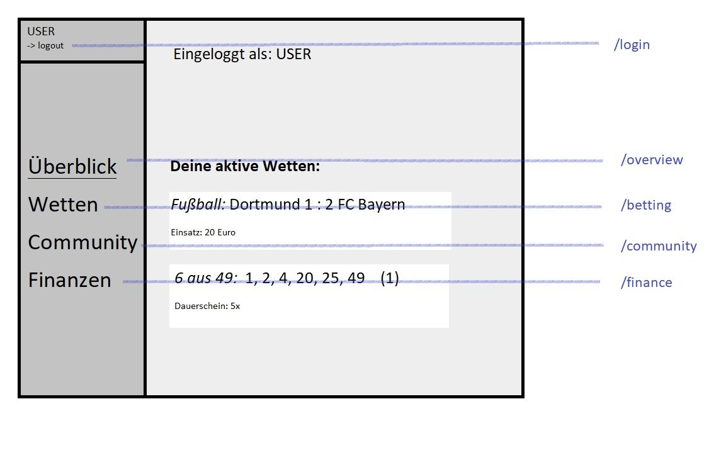

- Startseite nach erfolgreichem Login
- linke Spalte als Navigationsleiste mit Verweisen zu den Teilbereichen
- aktiver Nutzername und Logout-Funktion am oberen Rand platziert
- eingeloggt: Naviagtionsleiste immer mit gleichen Funktionen
- Hauptfeld mit aktiven Wetten gefüllt

=== /betting
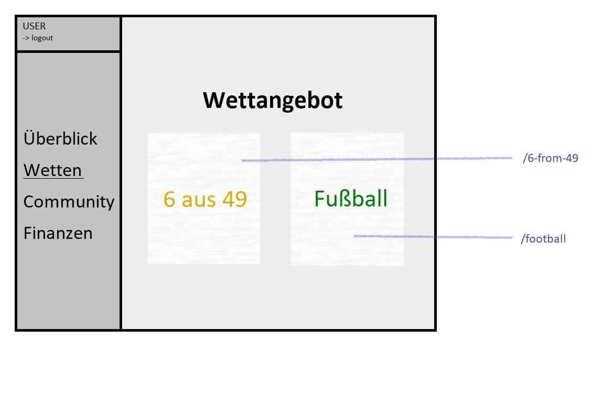

- zeigt Auswahl vom Wettangebot (erweiterbar)

=== /6-from-49
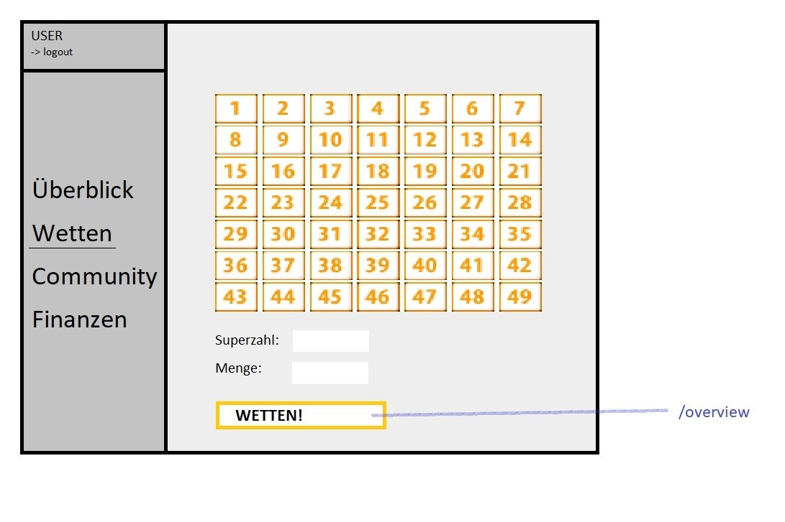

- Schaltfläche zur Auswahl von sechs Zahlen
- Menge angebbar (für Dauertippscheine)
- Wetten-Button platziert ohne Komplikationen die geplante Wette, schickt den Nutzer zur Übersichtsseite

=== /football
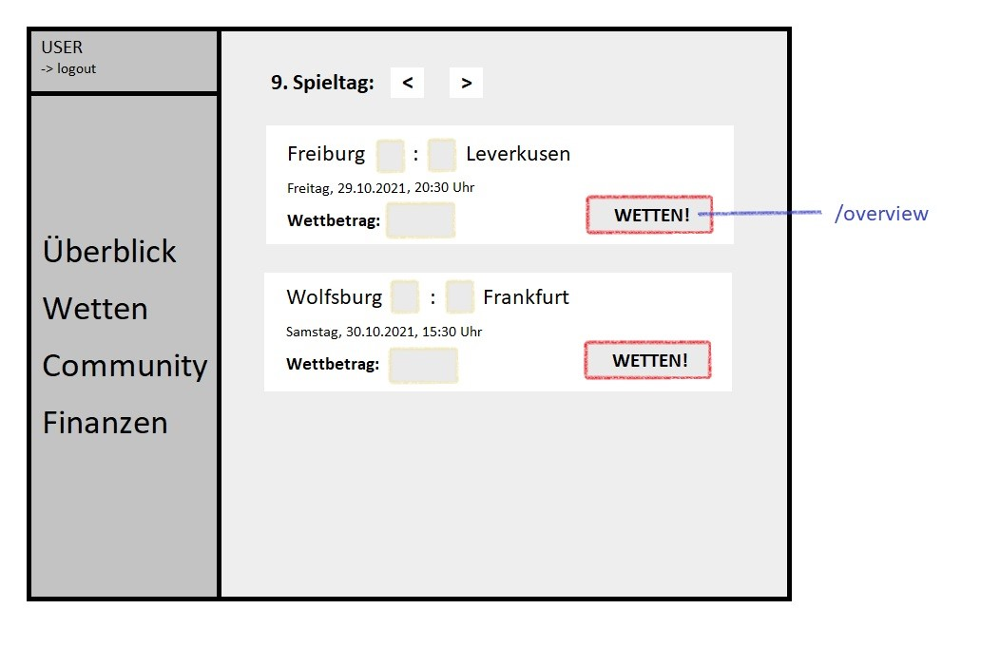

- Auflistung der verfügbaren Spiele
- Ergebnistipp möglich, Wahl des Wettbetrags variabel eingebbar
- Wette durch einen Klick platziert

=== /community
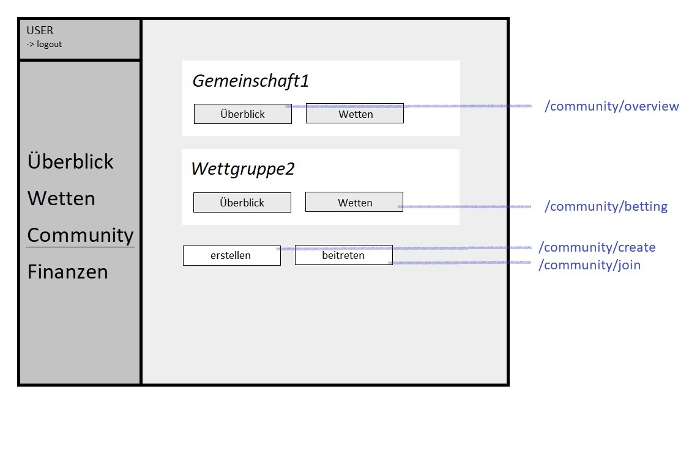

- Auflistung aller genutzten Communities des Nutzerkontos
- Möglichkeit, Community einzusehen, zu erstellen oder zu betreten

=== /community/create

- Formular zum Erstellen einer Community

=== /community/join
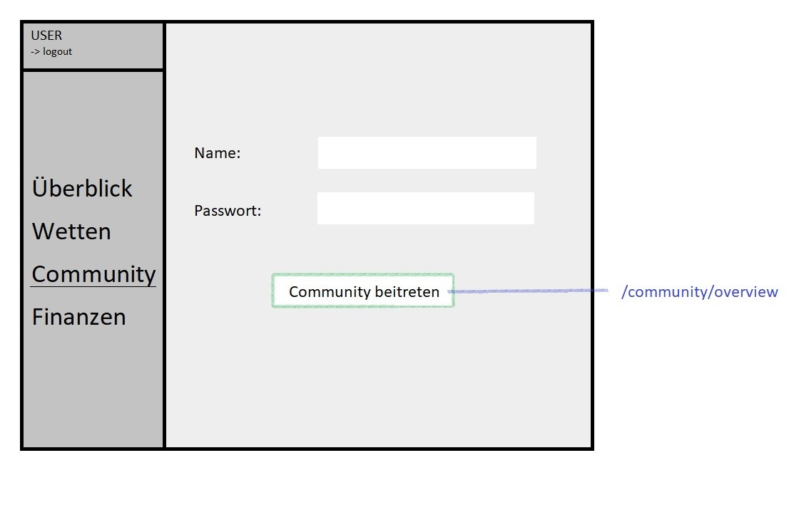

- Formular zum Beitreten einer Community

=== /community/overview
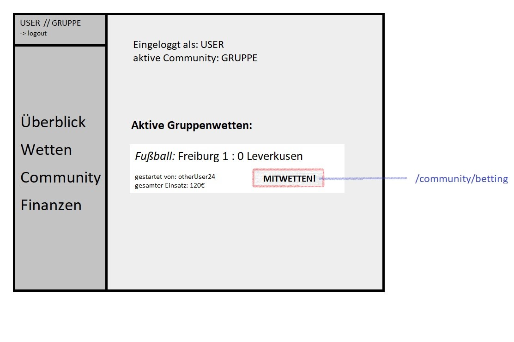

- Übersicht für einzelne Community
- zeigt Namen des Users an und aktiviert Community-Wetten
- oben links: Verdeutlichung, dass neue Wetten für Community platziert werden

=== /community/betting
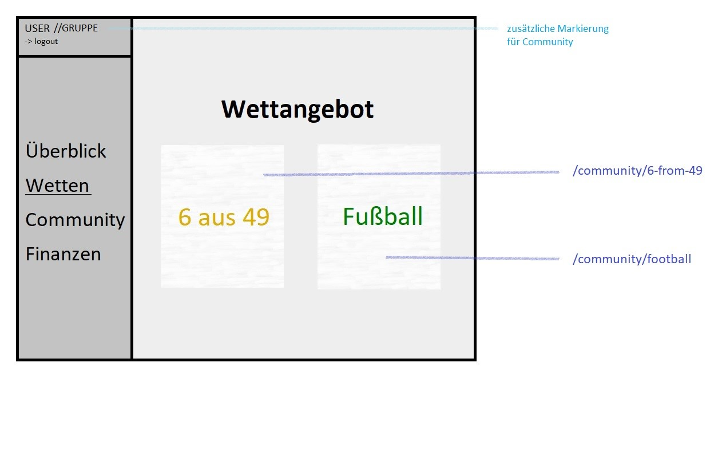

- Community Wetten nutzen die gleiche Maske wie Einzelnutzerwetten
- analog für Lotto und Fußballtoto

=== /finance
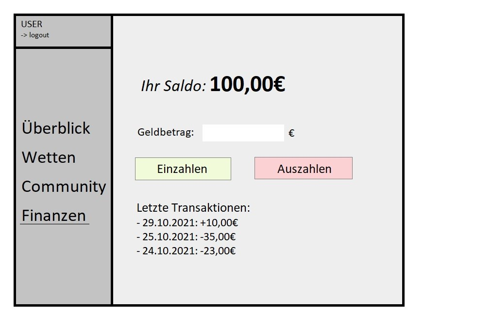

- Finanzübersicht mit aktuellem Saldo
- Möglichkeit, Geld ein- und auszuzahlen (gebunden an angegebenes Konto)

== Datenmodell

=== Überblick: Klassendiagramm
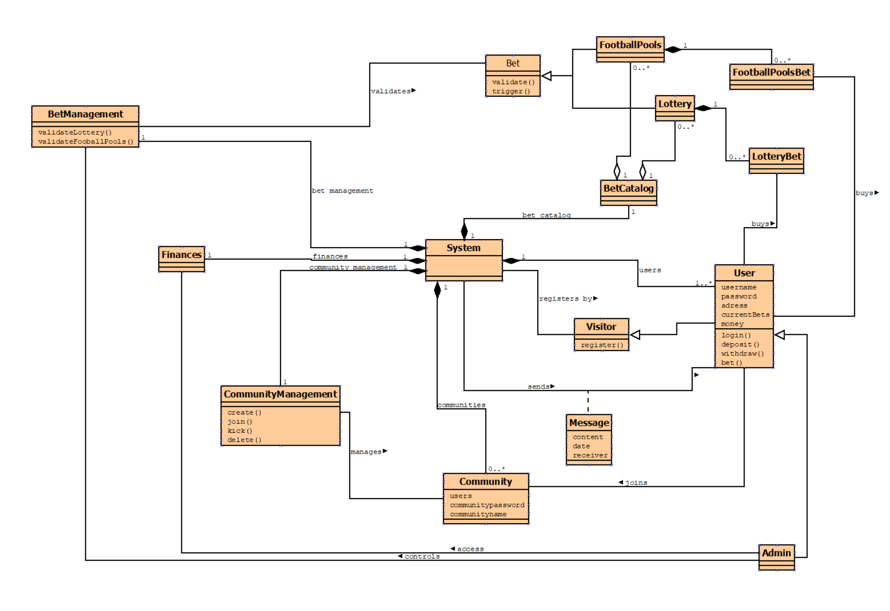

=== Klassen und Enumerationen

// See http://asciidoctor.org/docs/user-manual/#tables
[options="header"]
|===
|Klasse/Enumeration |Beschreibung
|System             |Zentrale Klasse, die alle Daten von Nutzern, Communities und den gesamten Wettprozess repräsentiert.
|Community          |Eine Gruppe von Benutzern.
|BetManagement      |Der Administrator kann die Lotterie effektiv verwalten.
|CommunityManagement  |Nutzer können selbst Communitys erstellen. Andere Nutzer können ebenfalls beitreten. Der Community-Verantwortliche kann Nutzer, die den Anforderungen der Community nicht entsprechen, rauswerfen und hat das Recht, die Community aufzulösen.
|Admin              |Der Verantwortliche der Lotteriezentrale kann Nutzer und Lottoauswertungen verwalten.
|User               |Benutzer, die sich erfolgreich auf der Website registriert haben.
|Visitor            |Benutzer, die nicht auf der Website registriert sind.
|Message            |Vom System gesendete Informationen, die vom Nutzer empfangen wurden.
|BetCatalog         |Eine Seite, auf der ein Nutzer auswählen kann, an welcher Lotterie er teilnehmen möchte, um eine Wette zu platzieren.
|Finances           |Der Administrator kann den Betrag verwalten, der bereits an der Wette teilgenommen hat.
|Lottery            |Bei Lottoscheinen mit 6 aus 49 Zahlen kann eine zusätzliche Zahl gewählt werden.
|FootballPools      |Fußballlotterie, erraten Sie das Ergebnis.
|Bet                |Nutzer können Wetten auf verschiedene Arten von Lottoscheinen platzieren.
|===

== Akzeptanztestfälle

[cols="1h, 4"]
[[AT0010]]
|===
|ID                     |**<<AT0010>>**
|Anwendungsfall         |**<<UC0010>>**
|Voraussetzungen       a|Ein Nutzer ist registriert und noch nicht angemeldet.
|Event                 a|Der Nutzer ruft den Anmeldebildschirm auf, gibt seine Anmeldedaten ein und drückt auf "Anmelden".
|Zu erwartendes Ergebnis a|
Der Nutzer wird, nach einer Validierung der Anmeldedaten, vom System angemeldet und auf die Startseite weitergeleitet.
|===

[cols="1h, 4"]
[[AT0020]]
|===
|ID                     |**<<AT0020>>**
|Anwendungsfall         |**<<UC0020>>**
|Voraussetzungen       a|Der Nutzer ist nicht registriert und möchte einen Account erstellen.
|Event                 a|Der Nutzer klickt auf "Registrieren", füllt das Formular aus und schickt es über "Registrierung abschließen" ab.
|Zu erwartendes Ergebnis a|
- Der Nutzer wird zu einem Willkommensseite weitergeleitet, der eine personalisierte Willkommensnachricht anzeigt.
- Der Nutzer hat nun Zugriff auf alle Funktionen, die für Nutzer mit der Rolle "Kunde" zugänglich sind.
- Der Nutzer ist authentifiziert.
|===

[cols="1h, 4"]
[[AT0021]]
|===
|ID                     |**<<AT0021>>**
|Anwendungsfall         |**<<UC0020>>**
|Voraussetzungen       a|Der Nutzer ist angemeldet
|Event                 a|Der Nutzer drückt auf "Ausloggen".
|Zu erwartendes Ergebnis a|
- Der Nutzer ist nun ausgeloggt.
- Der Nutzer wird zur Login-Seite weitergeleitet.
|===

[cols="1h, 4"]
[[AT0030]]
|===
|ID                     |**<<AT0030>>**
|Anwendungsfall         |**<<UC0030>>**
|Voraussetzungen       a|Der Nutzer ist angemeldet.
|Event                 a|Ein authentifizierter Nutzer klickt auf den Knopf "Zahlenlotterie" oder "Fußballtoto".
|Zu erwartendes Ergebnis a|
Falls Knopf "Zahlenlotterien" geklickt wird:
- Die Schaltfläche zum Platzieren der Wette wird angezeigt.

Falls Knopf "Fußballtoto" geklickt wird:
- Alle verfügbaren Fußballtotos werden angezeigt.
|===

[cols="1h, 4"]
[[AT0040]]
|===
|ID                     |**<<AT0040>>**
|Anwendungsfall         |**<<UC0040>>**
|Voraussetzungen       a|Ein Nutzer hat sich angemeldet und ist in der Startseite.
|Event                 a|Der Nutzer drückt in der Navigationsleiste auf den Button „betting“.
|Zu erwartendes Ergebnis a|
- Der Nutzer betritt die "betting"-Schnittstelle.
- Der Nutzer kann die Art des Lottoscheins auswählen, den er kaufen möchte.
|===

[cols="1h, 4"]
[[AT0041]]
|===
|ID                     |**<<AT0041>>**
|Anwendungsfall         |**<<UC0040>>**
|Voraussetzungen       a|Der Nutzer hat die „betting“-Schnittstelle aufgerufen.
|Event                 a|Der Nutzer klickt auf den Knopf "6-from-49".
|Zu erwartendes Ergebnis a|
- Der Nutzer wählt 6 Ziffern aus den verfügbaren 49 Ziffern aus.
- Der Nutzer fügt Superzahl hinzu.
- Der Nutzer kann die Art des „Dauertippscheins“ wählen.
- Der Nutzer platziert die Wette.
|===

[cols="1h, 4"]
[[AT0042]]
|===
|ID                     |**<<AT0042>>**
|Anwendungsfall         |**<<UC0040>>**
|Voraussetzungen       a|Der Nutzer hat die „betting“-Schnittstelle aufgerufen.
|Event                 a|Der Nutzer klickt auf den Knopf "Fußballtoto".
|Zu erwartendes Ergebnis a|
- Der Nutzer kann die vorhergesagte Punktzahl des Spiels eingeben.
- Der Nutzer kann den Betrag eingeben und eine Wette platzieren.
|===

[cols="1h, 4"]
[[AT0050]]
|===
|ID                     |**<<AT0050>>**
|Anwendungsfall         |**<<UC0050>>**
|Voraussetzungen       a|Der Nutzer ist angemeldet.
|Event                 a|Der Nutzer klickt auf den Knopf "Kontostand".
|Zu erwartendes Ergebnis a|Der Kontostand wird angezeigt.
|===

[cols="1h, 4"]
[[AT0060]]
|===
|ID                     |**<<AT0060>>**
|Anwendungsfall         |**<<UC0060>>**
|Voraussetzungen       a|Der Nutzer ist angemeldet.
|Event                 a|
_withdraw_: Der Nutzer klickt auf den Knopf "withdraw".

_deposit_: Der Nutzer klickt auf den Knopf "deposit".
|Zu erwartendes Ergebnis a|
- Der Nutzer wird auf "withdraw.html"/"deposit.html" weitergeleitet.
- Der Nutzer wählt den Betrag, den er aufladen oder abheben möchte.
|===

[cols="1h, 4"]
[[AT0080]]
|===
|ID                           |**<<AT0080>>**
|Anwendungsfall               |**<<UC0080>>**
|Voraussetzung                |Der Nutzer ist angemeldet.
|Event                       a|
Der Nutzer klickt auf der Navigationsleiste unter "Community" auf den Knopf "create".
|Zu erwartendes Ergebnis     a|
- Eine Gemeinschaft wird gegründet.
- Der Nutzer erhält ein Gemeinschaftspasswort und kann mit diesem Passwort andere Nutzer einladen, der Gemeinschaft beizutreten.
|===

[cols="1h, 4"]
[[AT0090]]
|===
|ID                           |**<<AT0090>>**
|Anwendungsfall               |**<<UC0090>>**
|Voraussetzung                |Der Nutzer ist angemeldet.
|Event                       a|
1. Der Nutzer drückt auf der Navigationsleiste unter "Community" auf den Knopf "join".
2. Der Nutzer gibt das Gemeinschaftspasswort ein.
|Zu erwartendes Ergebnis     a|
-Falls das Passwort gültig ist, tritt der Nutzer der Gemeinschaft bei.
-Falls das Passwort ungültig ist, wird eine Fehlermeldung ausgegeben.
|===

== Glossar
[options="header", cols="2, 4"]
|===
|Administrator |Verwalter der Plattform mit besonderer Einsicht in alle Wetten und der Finanzsituation
|Begriff |Beschreibung
|Besucher (Visitor) |unregistrierte Person, die die Online-Lotterie besucht
|Bundesliga |1. Fußballliga Deutschland
|Gewinngemeinschaft |Gruppe von Nutzern, die gemeinsam Wetten und anteilsmäßige Gewinne erzielen
|Konto |im System erfasster Datensatz, der personalisierte Online-Wetten ermöglicht
|Nutzer (User) |registrierte Person mit gültigem Konto
|Tippschein |abgeschlossene Wette mit gewünschtem Ergebnis
|Zahlenlotterie |konventionelle Lotterie "6 aus 49" mit Superzahl
|===
